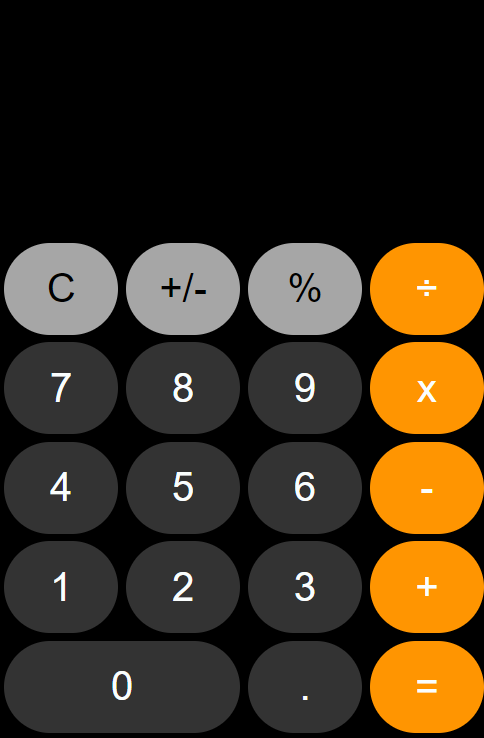

# Iphone Calculator Clone

## Table of Contents
- [Project Goal](#Project-Goal)
- [Links](#Links)
- [Implemented Technologies](#Implemented-Technologies)
- [Screenshot of Application](#Screenshot-of-Application)
- [User Instructions](#User-instructions)
- [License](#License)
- [Contribution](#Contribution)
- [Acknowledgements](#Acknowledgements)
- [Questions](#Questions)

## Project Goal
The creator's intentions for this project include:
1. To create an application utilizing HTML5, CSS3, and JavaScript, that replicates both the display and functionality of an iPhone Calculator.
2. For the display to be responsive to all screensizes.

## Implemented Technologies
- Vanilla JavaScript
- Web APIs 
- Advanced CSS3
- Responsive Design
- HTML5

## Links
- ### [URL to Deployed Application](https://inklein1997.github.io/iPhone-Calculator-Clone/)
- ### [URL to Github Repository](https://github.com/inklein1997/iPhone-Calculator-Clone)

## Screenshot of Webpage

## User Instructions
1. To input a value, the user must **click** any button with a number.
2. To select an operation, the user must **click** any button with an operation, after they have selected a number value.
3. To clear all values, the user must **click** the button labels with a "**C**".

## License
This project is licensed under the terms of [MIT](https://opensource.org/licenses/MIT).
  
## Contribution
Before contributing to **Stopwatch iPhone Clone**, please read this [code of conduct](code_of_conduct.md)[^1]. 
Here's how you can contribute...
1. Add issue or recommendation for improvement to Issues tab on Github.
2. Submit pull request for review.

## Acknowledgements
The design of this application is based off of the design of an iPhone calculator.

## Questions
If you have any questions, please contact me via:
1. GitHub -- [@inklein1997](https://github.com/inklein1997)
2. Email -- michaelklein1997@gmail.com

[^1]: Code of Conduct provided by [Contributor Covenant](https://www.contributor-covenant.org/)